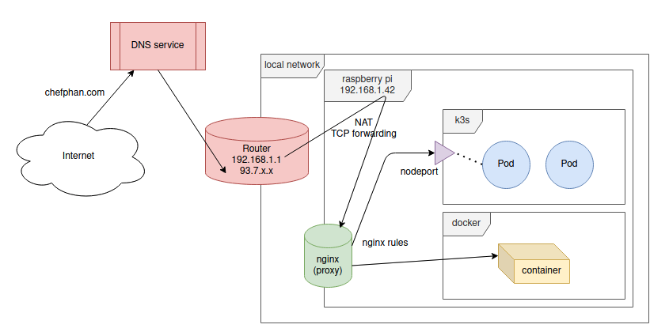

# ReTeX
Latex is great but not always [easy to install]

Install Latex fancy packages, e.g. fontawsome, on an architecture like Mac OS is somtimes a challenge [at least for a friend of mine]

More over, a full Latex installation costs arround 6GB of disk.

ReTex is an easy way to work with Latex whenever and wherever you need !
# Architecture
Front-end in React & Back-end in python:


# Network configuration


# How to use

## Easy way

Just use the web service avaible at : https://etangdesapplis.github.io/ReTeX/

## Hard way

You need to install docker on your PC

```
docker run -p 3000:3000 -p 5000:5000 etangdesapplis/retex
```
